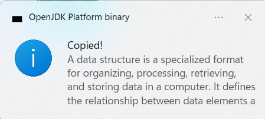

# 📋 Clipboard Copy Notifier

A simple Java application that detects when text is copied (`Ctrl + C`) and shows a notification popup with the copied content.  

## 🚀 Features
- Monitors clipboard in real-time  
- Shows popup notification when text is copied  
- Lightweight and easy to run  

## 🖼️ Screenshot


## 🛠️ How to Run
1. Clone this repository  
   ```bash
   git clone https://github.com/RevathiCheedepudi/clipboard-copy-notifier
